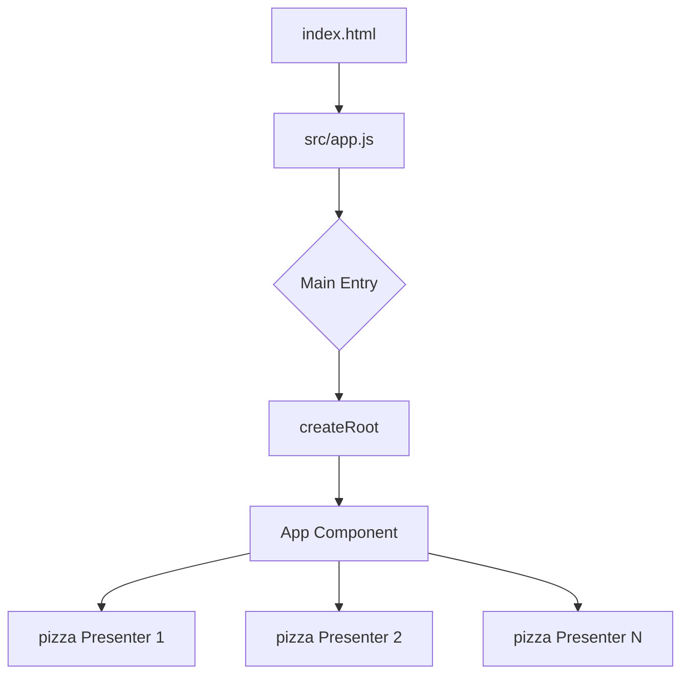

# Pizza Catalog - React Core API Reference

A production-grade demonstration of React rendering fundamentals, focusing on the raw `React.createElement` API. This project serves as an architectural blueprint for understanding Virtual DOM construction without JSX abstraction.

## Project Overview

### Purpose

This project provides a transparent view of React's internal component instantiation process. By bypassing JSX, it allows developers to interact directly with the core rendering engine, making it an ideal reference for low-level UI debugging, custom renderer development, or pedagogical deep-dives into React's architecture.

### Problem Statement

Standard React workflows leverage JSX (JavaScript XML), which is transpiled into `React.createElement` calls via Babel or SWC. For senior engineers, this abstraction can obscure:

- Exactly how props are injected into component functions.
- The recursive nature of the Virtual DOM tree.
- The performance implications of nested element creation.

### Solution

A modular, high-performance catalog system implemented using:

- **Pure JavaScript**: No JSX transpilation required.
- **Concurrent Rendering**: Fully compatible with React 18's `createRoot`.
- **Modern Module System**: Optimized for Vite's ES module-first architecture.

## Features

- **Component Abstraction**: A reusable `pizza` component pattern demonstrating property-driven rendering.
- **Pure Instantiation**: Implementation of nested UI trees using raw `React.createElement` calls.
- **Vite 7 Integration**: Leveraging modern build tooling for <100ms HMR (Hot Module Replacement).
- **Type-Safe Documentation**: Use of JSDoc-style patterns (inferred) and strict ESLint 9 rules for code quality.
- **RTL/Bootstrap Ready**: Designed with a clean DOM structure capable of supporting any CSS-in-JS or utility-first styling library.

## Tech Stack

| Component      | Technology | Rationale                                                                 |
| :------------- | :--------- | :------------------------------------------------------------------------ |
| **Core**       | React 18.3 | Stability, Concurrent Mode, and industry-standard rendering.              |
| **Runtime**    | Node.js    | Standardized execution environment.                                       |
| **Build Tool** | Vite 7.3   | Superior development speed compared to Webpack/Rollup.                    |
| **Linter**     | ESLint 9.9 | Ensures adherence to modern ECMAScript standards and flat config support. |

## Project Architecture

The application follows a unidirectional data flow and a functional component hierarchy.

### Component Logic Flow



### Folder Responsibilities

- **`src/`**: Contains the core application logic.
  - `app.js`: The "God File" by design for this reference project, containing both the component definitions and the bootstrap logic.
- **`index.html`**: Host document that provides the DOM hook (`#root`) for React.
- **`vite.config.js`**: Optimization settings for the local dev server and production builds.
- **`eslint.config.mjs`**: Configuration for technical quality and consistency checks.

## Installation & Setup

### Prerequisites

- **Node.js**: v18.0.0 or higher (Recommended: v20 LTS).
- **npm**: v9.0.0 or higher.

### Local Development Setup

1. **Clone the Repository**:

   ```bash
   git clone <repository-url>
   cd mostafa-naeam
   ```

2. **Install Dependencies**:

   ```bash
   npm install
   ```

3. **Execution Environment**:
   No environment variables (`.env`) are required for the base catalog. If integrating a backend, refer to the `Future Improvements` section.

4. **Launch Application**:
   ```bash
   npm run dev
   ```
   The application will be accessible at `http://localhost:5173`.

## Usage

### Developer Flow

To add a new item to the catalog, maintainers must follow the established `React.createElement` pattern:

```javascript
React.createElement(pizza, {
  name: "New Product Name",
  description: "Detailed technical description of the product.",
});
```

### Script Reference

- `npm run dev`: High-speed development mode with HMR.
- `npm run build`: Production bundling (removes development-only warnings).
- `npm run preview`: Verifies the production build locally.

## Development Notes

### Architectural Decisions

- **Avoidance of JSX**: This is a deliberate choice for this specific project. It prevents "magic" transpilation and ensures that every line of code is valid standard JavaScript.
- **`app.js` Structure**: Components are defined as constants within the same file to minimize export/import overhead in this foundational reference.
- **Vite 7**: We've opted for the latest major version of Vite to ensure long-term support for modern browser features and ES modules.

### Constraints & Trade-offs

- **Verbosity**: Pure `React.createElement` is more verbose than JSX. This is accepted for the benefit of technical transparency.
- **Styling**: Current styles are minimal. The project expects future implementers to choose a styling strategy (CSS Modules/Tailwind).

## Future Improvements

- **State Management**: Integration of `useReducer` for complex catalog filtering.
- **Dynamic Fetching**: Transition from hardcoded data to a `fetch`/`useEffect` pattern from a REST API.
- **Unit Testing**: Implementation of **Vitest** to verify component rendering logic.
- **JSX Migration**: A planned migration path is available once the team masters the underlying React fundamentals.

## Contribution Guidelines

1. **Standards**: All code must conform to the Flat ESLint 9 configuration.
2. **Patterns**: Maintain the functional component pattern. Class-based components are deprecated for this project.
3. **Documentation**: Any new child components must be documented with JSDoc headers if complexity increases.
4. **Pull Requests**: Submit changes via PRs only. Direct commits to `main` are restricted.

## License

This project is licensed under the **MIT License**.
